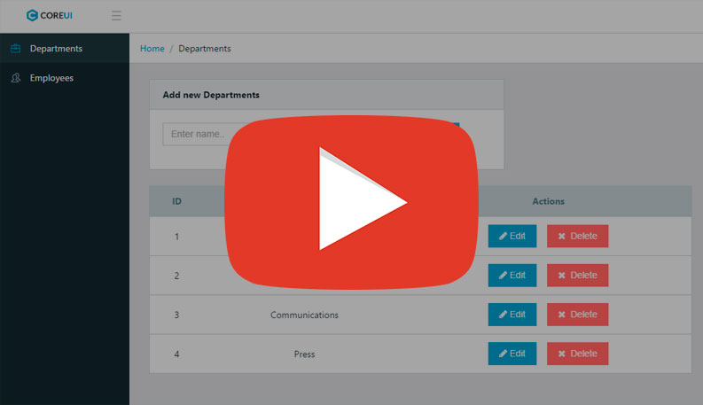

## React Redux-Saga Admin Test Project

[](https://youtu.be/X6ldtdUfrEg)

Based on `React`, `React-router`, `Redux`, `Redux-Saga` and [CoreUI](http://coreui.io/)

To get started, run following code in your console: 

```
git clone https://github.com/KarafiziArtur/redux-saga-admin-test-project
```
```
cd the-movie-db-redux
yarn install
```
This project uses `json-server` as mocked DB. So for use it needs to install it and run the `db.json`:  
```
npm i -g json-server
json-server db.json
```  
Then run the project:
```
yarn start
```
To work with SCSS it needs to run gulp:
```
gulp
```